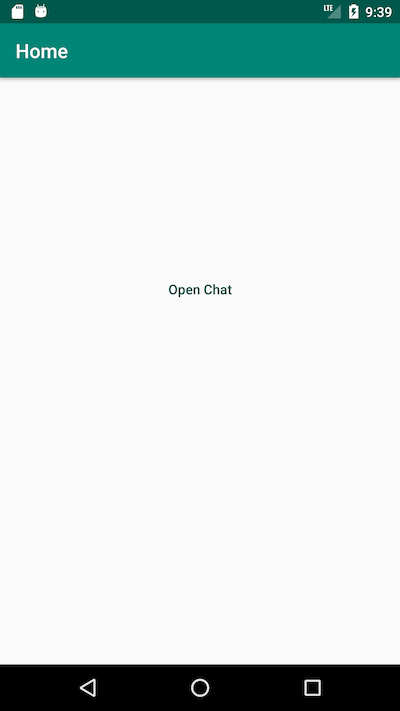
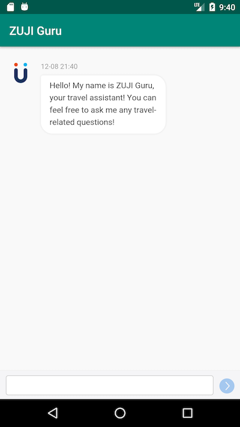

# [Travelflan](https://www.travelflan.com/) Widget iOS Usage Sample For Zuji


## Introduction

This repo demonstrated how to use the chatbot in android app for Zuji project.

## Quick Start

1. Define an entry for the chatbot.
2. Open the chatbot view when clicked the entry.




## Usage
```
package com.travelflan.zuji.zujiandroidsample;

import android.support.v7.app.AppCompatActivity;
import android.os.Bundle;
import android.content.Intent;
import android.view.View;

public class MainActivity extends AppCompatActivity {

    @Override
    protected void onCreate(Bundle savedInstanceState) {
        super.onCreate(savedInstanceState);
        setContentView(R.layout.activity_main);
    }

    public void onOpenChatButtonClick(View v) {
        Intent intent = new Intent(MainActivity.this, ChatActivity.class);
        startActivity(intent);
    }

}
```

```
package com.travelflan.zuji.zujiandroidsample;

import android.support.v7.app.AppCompatActivity;
import android.os.Bundle;
import android.webkit.WebSettings;
import android.webkit.WebView;
import android.view.ViewGroup.LayoutParams;

public class ChatActivity extends AppCompatActivity {

    private WebView webView;

    @Override
    protected void onCreate(Bundle savedInstanceState) {
        super.onCreate(savedInstanceState);
        setWebView();
    }

    private void setWebView() {
        LayoutParams params = new LayoutParams(LayoutParams.MATCH_PARENT,LayoutParams.MATCH_PARENT);
        webView = new WebView(this);
//        webView.setWebChromeClient(new WebChromeClient() {
//            @Override
//            public boolean onConsoleMessage(ConsoleMessage consoleMessage) {
//                Log.d("MyApplication", consoleMessage.message() + " -- From line "
//                        + consoleMessage.lineNumber() + " of "
//                        + consoleMessage.sourceId());
//                return super.onConsoleMessage(consoleMessage);
//            }
//        });
        webView.setLayoutParams(params);
        WebSettings webSettings = webView.getSettings();
        webSettings.setJavaScriptEnabled(true);
        webSettings.setDomStorageEnabled(true);
        webSettings.setDatabaseEnabled(true);
        webSettings.setCacheMode(WebSettings.LOAD_NO_CACHE);
        webView.loadUrl("https://alpha-zuji-widget.travelflan.com.cn/?region=hk&locale=en_us&platform=android");
        setContentView(webView);
    }
}
```